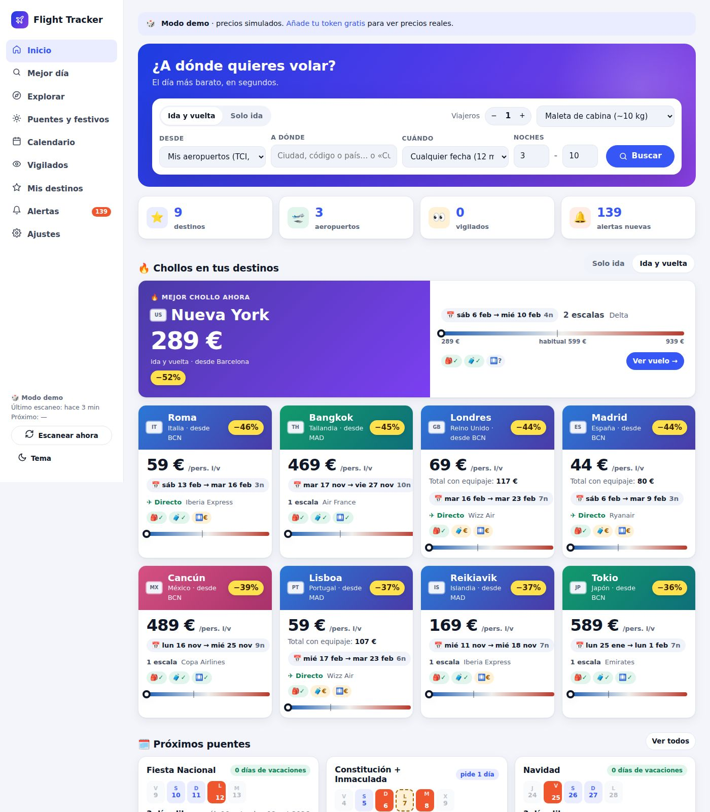
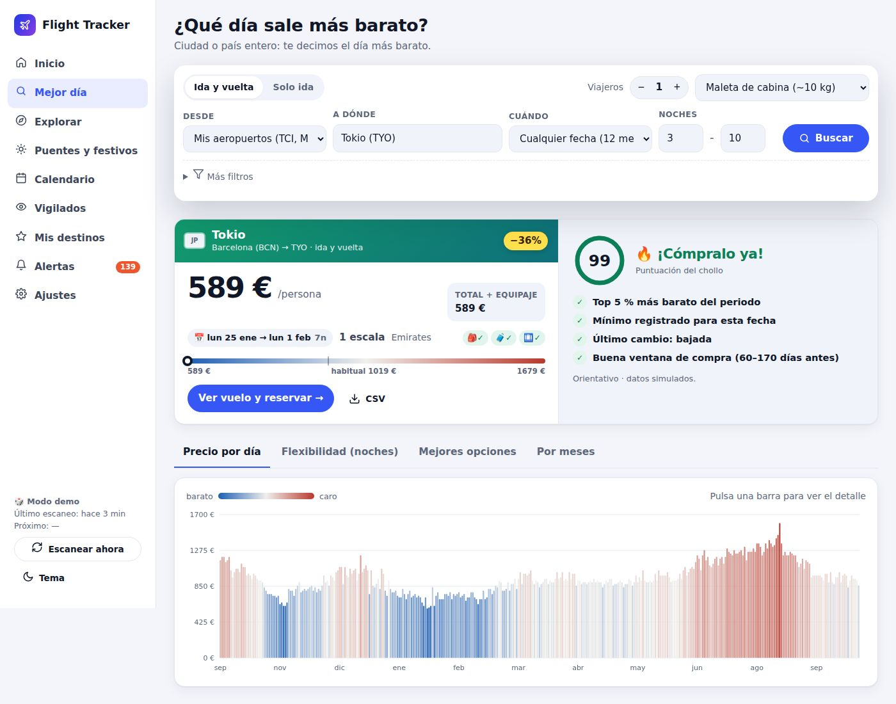
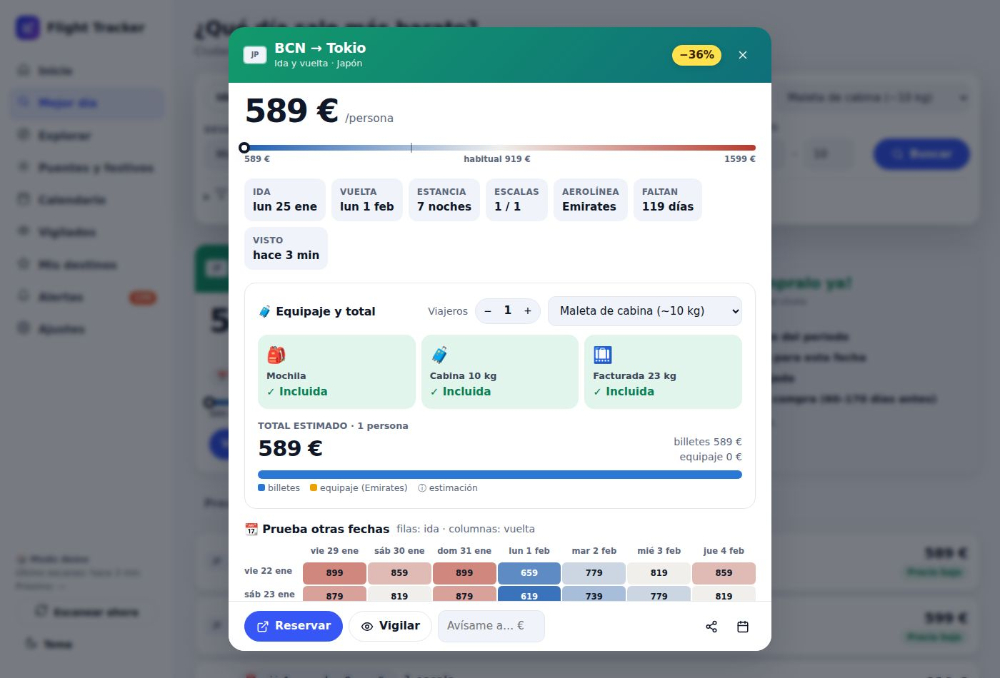
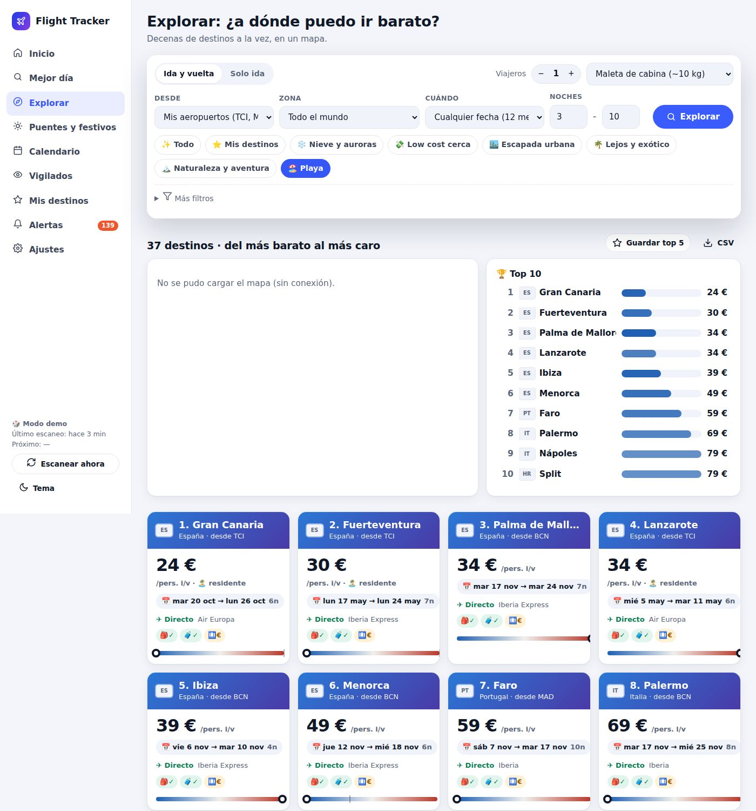
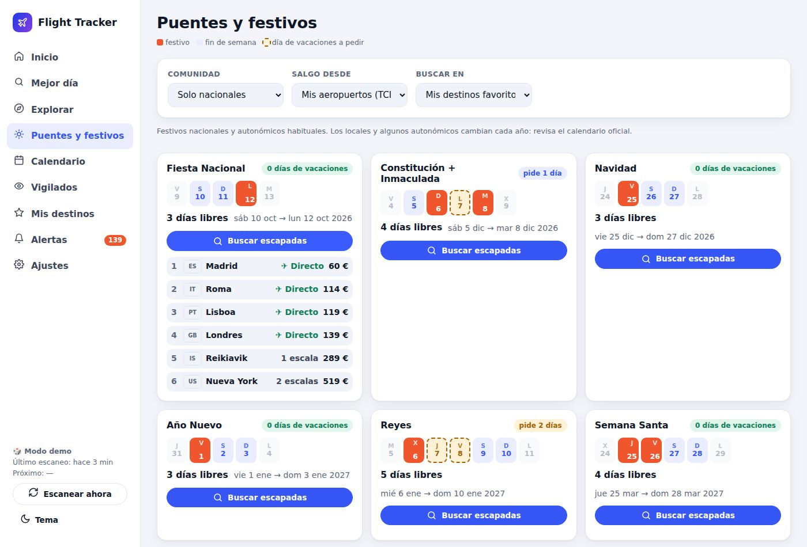
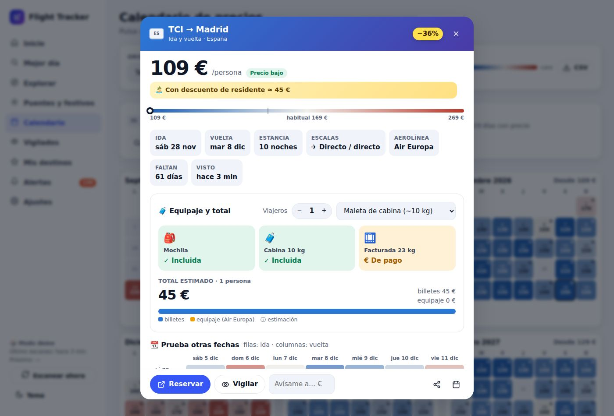

# ✈️ Flight Tracker

Tu buscador y vigilante de vuelos **personal**. Le dices desde dónde sales (un aeropuerto, varios o toda España) y a dónde te gustaría ir. La app:

- 🗓️ vigila el **precio más barato de cada día de los próximos 12 meses**, **solo ida y también ida y vuelta**;
- 🔎 te dice **qué día puedes volar más barato** a una ciudad o a un país entero, con matriz de flexibilidad por noches (**Mejor día**);
- 🧭 compara decenas de destinos a la vez en un **mapa**, por zona, temática o presupuesto (**Explorar**);
- 🏖️ calcula tus **puentes y festivos** (nacionales y de tu comunidad) y busca la escapada más barata para cada uno;
- 🧳 estima el **equipaje incluido** (mochila, cabina, facturada) y el **precio total real** por aerolínea y viajeros;
- 🏝️ calcula el precio con **descuento de residente** (Canarias y Baleares: 75 % en vuelos nacionales);
- 🔥 detecta **chollos, bajadas, mínimos históricos** y precios bajo tu objetivo, y te **avisa con antelación** por Telegram, push al móvil (ntfy) o email;
- 👀 te deja **vigilar vuelos concretos** (ida o ida y vuelta) y te avisa si suben o bajan;
- ⚡ comprueba el **precio real en Google Flights** con su rango habitual y su historial (opcional, con SerpApi);
- 📱 funciona en el **móvil como una app** (PWA) y se puede **publicar online** con contraseña.

| Inicio | Mejor día |
|---|---|
|  |  |
| **Detalle, equipaje y cuadrícula de fechas** | **Explorar destinos** |
|  |  |
| **Puentes y festivos** | **Descuento de residente** |
|  |  |

---

## 🚀 Arranque rápido

Necesitas **Python 3.10 o superior** ([descargar](https://www.python.org/downloads/); en Windows marca *Add python.exe to PATH*).

- **Windows:** doble clic en **`iniciar.bat`**.
- **macOS / Linux:** `./iniciar.sh`.

Se instala todo solo y se abre **http://localhost:8000**. Un asistente te pregunta:

1. desde dónde vuelas;
2. a dónde quieres ir;
3. cómo viajas (ida y vuelta, noches, viajeros, equipaje);
4. cómo quieres recibir los avisos.

<details><summary>Manualmente</summary>

```bash
python -m venv .venv
.venv\Scripts\activate          # Windows  (macOS/Linux: source .venv/bin/activate)
pip install -r requirements.txt
python -m app
```
</details>

Sin configurar nada funciona en **modo demo**, con un simulador de precios realista. Para usar **precios reales** solo necesitas un token gratuito de Travelpayouts (ver abajo).

## 🌍 Usarla online y gratis

Mira **[DEPLOY.md](DEPLOY.md)**. Estas son las opciones gratuitas:

- **GitHub Actions** (incluido): escaneos y avisos cada 6 horas aunque apagues el PC.
- **Oracle Cloud Always Free + Tailscale Funnel**: la web entera online 24/7, gratis.
- **Tu PC + túnel** (Tailscale o Cloudflare).

Si prefieres no complicarte, **Railway** cuesta unos 5 $/mes. Pon siempre `APP_PASSWORD`: la web pedirá contraseña.

---

## 🔑 Fuentes de precios

| Fuente | Para qué | Coste |
|---|---|---|
| **Travelpayouts / Aviasales Data API** | Escaneos automáticos, calendario, Mejor día, Explorar | Gratis (token) |
| **SerpApi – Google Flights** (opcional) | «Comprobar precio real»: precio en vivo, nivel bajo/normal/alto, rango habitual, historial, filtro de maletas y clase | 250 búsquedas/mes gratis |
| **Demo** | Probar todo sin claves | Gratis |

1. **Travelpayouts:** regístrate en [travelpayouts.com](https://www.travelpayouts.com), copia tu *API token* y pégalo en **Ajustes → Fuente de precios**.
2. **SerpApi:** crea una cuenta en [serpapi.com](https://serpapi.com) y pega la clave en Ajustes.

> La API *self-service* de Amadeus cerró su portal el 17 de julio de 2026, por eso no se usa.

## 🧳 Equipaje

Las APIs de precios **no dicen qué equipaje incluye cada billete**. Flight Tracker lo **estima** con una tabla de políticas por aerolínea (Ryanair, Vueling, easyJet, Iberia, Air Europa, Binter, Emirates, Qatar…). Así:

- muestra qué va incluido en cada vuelo (🎒 mochila · 🧳 cabina · 🛄 facturada);
- calcula el **precio total estimado** según tu opción de equipaje, ida o ida y vuelta, y número de viajeros, y ordena los resultados por ese total.

Son rangos orientativos de reservar online con antelación. En junio de 2026 la UE acordó que el precio mostrado incluya por defecto una maleta de cabina de 7 kg, pero **aún no se aplica**. Con SerpApi, «Comprobar precio real» pide a Google Flights precios que ya incluyen tu maleta de cabina.

## 🔔 Avisos

| Alerta | Cuándo |
|---|---|
| 🏆 Mínimo histórico | El precio más bajo visto nunca en esa ruta |
| 🔥 Chollo | Un X % por debajo del precio habitual del año (por defecto, 30 %) |
| 🎯 Bajo tu precio | Por debajo del máximo que pusiste para ese destino |
| 📉 Bajada | Ese mismo día ha bajado un X % desde el escaneo anterior |
| 👀 Vuelo vigilado | Una fecha concreta que sigues sube o baja un X %, o baja de tu objetivo |

- Solo avisa de vuelos con **al menos N días de antelación** (por defecto, 14), para que te dé tiempo a reservar.
- Tiene **anti-spam**: no repite un aviso salvo que baje otro X %.
- Tiene **horas de silencio** (por ejemplo, `23-8`): lo que se detecte de noche se envía por la mañana.
- Envía **un único resumen** por escaneo.

**Canales:**

- **Telegram:** crea un bot con @BotFather y consigue tu *chat id* abriendo `https://api.telegram.org/bot<TOKEN>/getUpdates`.
- **ntfy:** app gratuita; te suscribes a un tema privado.
- **Email** por SMTP. En Gmail necesitas una contraseña de aplicación.

## 🧠 ¿Compro ya o espero?

Cada resultado incluye un consejo orientativo basado en:

- en qué percentil está el precio frente al resto de fechas;
- el histórico registrado para esa fecha;
- la opinión de Google Flights, si usas SerpApi;
- la antelación: suele haber buena ventana a 21–90 días en vuelos cortos y a 60–170 días en largo radio.

Nadie puede garantizar el precio futuro de un vuelo.

## 🎲 Modo demo realista

El simulador tiene en cuenta:

- la distancia real y la competencia low-cost;
- los hubs con vuelo directo (MAD y BCN);
- las temporadas por región, los destinos de playa y los de sol en invierno (Canarias, Madeira…);
- Semana Santa, Navidad y los puentes;
- el día de la semana y la curva de antelación;
- rebajas de aerolíneas, tarifas flash y escalones de tarifa;
- las combinaciones de ida y vuelta.

También genera unas semanas de histórico. Úsalo para probar la app: **no son precios reales**.

---

## 🗂️ Estructura

```
app/
  __init__.py        API web (Flask), login, PWA
  tracker.py         escaneos, alertas, motor de búsqueda (Mejor día / Explorar / Festivos), consejos
  airlines.py        aerolíneas y políticas de equipaje (estimadas)
  holidays.py        festivos de España y cálculo de puentes
  catalog.py         ~150 ciudades con coordenadas, temáticas, orígenes de España
  notifier.py        Telegram, ntfy, email (+ horas de silencio)
  scheduler.py       escaneo automático
  db.py              SQLite, ajustes y migraciones automáticas
  providers/         travelpayouts.py (real) · serpapi.py (Google Flights) · demo.py (simulación)
  static/            interfaz (HTML/CSS/JS sin dependencias), service worker, iconos
tests/               python -m pytest   (o python -m unittest)
DEPLOY.md            cómo publicarla online
```

**Comandos útiles:**

- `python -m app` arranca la web.
- `python -m app scan` hace un escaneo único y envía los avisos (útil con cron).
- `python -m pytest` pasa los tests.

**Actualizar desde una versión anterior:** tus destinos, alertas y ajustes se conservan. La base de datos se migra sola.

## Licencia

MIT.
