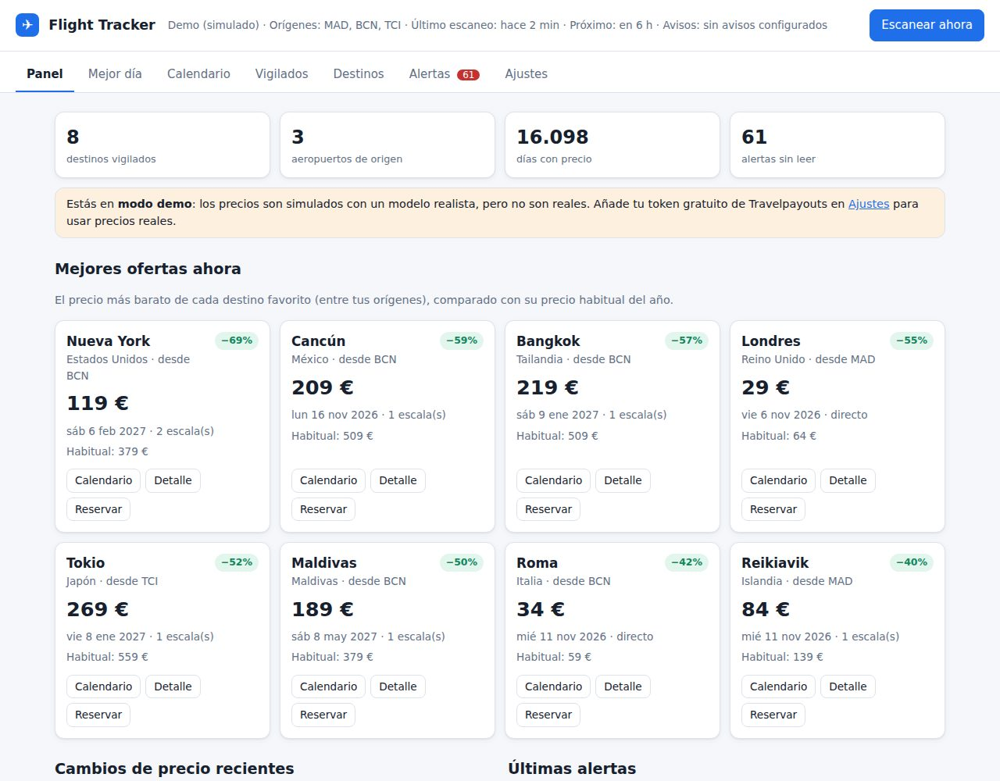
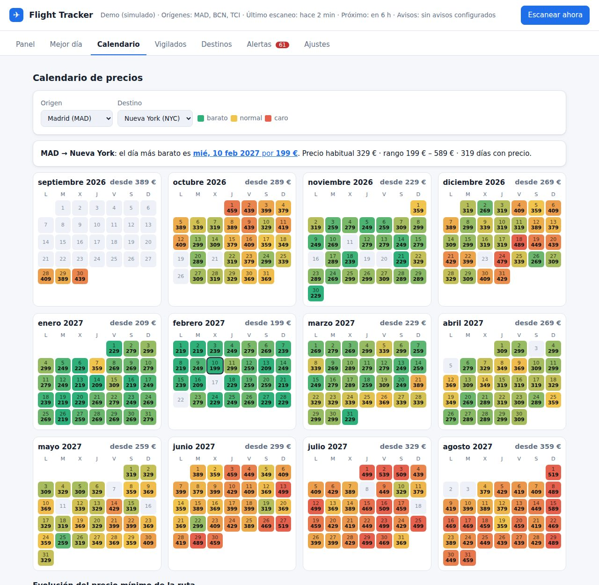

# ✈️ Flight Tracker

Buscador y vigilante de precios de vuelos **autoalojado**. Eliges desde dónde sales (un aeropuerto, varios o toda España) y tus destinos favoritos en cualquier país. La app:

- vigila el **precio más barato de cada día de los próximos 12 meses** para cada ruta;
- te dice **qué día puedes volar más barato** a cualquier ciudad o país («Mejor día»);
- detecta **chollos, bajadas de precio, mínimos históricos** y precios por debajo de tu objetivo;
- guarda el **historial de cambios** de cada fecha (sube/baja) y te deja **vigilar vuelos concretos**;
- te **avisa con antelación** por Telegram, notificación push (ntfy) o email;
- opcionalmente comprueba el **precio real en vivo en Google Flights**, con su rango habitual y su histórico de precios.

| Panel | Mejor día |
|---|---|
|  |  |
| **Calendario de precios** | **Detalle de un día** |
|  |  |

---

## 🚀 Arranque rápido (5 minutos)

Necesitas **Python 3.10 o superior** ([descargar](https://www.python.org/downloads/)).

```bash
git clone https://github.com/TU_USUARIO/flight-tracker.git
cd flight-tracker
python -m venv .venv
# Windows:            .venv\Scripts\activate
# macOS / Linux:      source .venv/bin/activate
pip install -r requirements.txt
python -m app
```

Abre **http://localhost:8000**, ve a **Destinos**, añade ciudades o países y pulsa **Escanear ahora**.

> Sin configurar nada, la app funciona en **modo demo**, con precios simulados por un modelo realista (ver más abajo). Para usar precios reales solo necesitas un token gratuito de Travelpayouts.

### Con Docker

```bash
cp .env.example .env      # rellena lo que quieras
docker compose up -d --build
```

Los datos se guardan en `./data/flights.db`.

---

## 🔑 Configurar precios reales (gratis)

### 1. Travelpayouts / Aviasales Data API (recomendado para los escaneos)

1. Regístrate gratis en [travelpayouts.com](https://www.travelpayouts.com).
2. Entra en tu perfil y copia tu **API token** (en *Profile → API token* o *Tools → API*).
3. Pégalo en **Ajustes → Fuente de precios → Token de Travelpayouts** (o en `.env` como `TRAVELPAYOUTS_TOKEN`).

Esta API da el precio más barato por día que han encontrado los usuarios de Aviasales en los últimos días (datos en caché). Es gratuita y te permite ver el calendario de todo el año sin pagar por búsqueda. En rutas muy poco buscadas puede haber días sin datos.

### 2. SerpApi – Google Flights (opcional, para comprobar antes de comprar)

1. Crea una cuenta en [serpapi.com](https://serpapi.com). El plan gratuito incluye 250 búsquedas al mes.
2. Pega la clave en **Ajustes → Clave SerpApi**.
3. En el detalle de cualquier día aparecerá el botón **«Comprobar precio real (Google Flights)»**, que muestra:
   - el precio más barato **ahora mismo**, con aerolíneas, escalas y horarios;
   - si Google considera el precio **bajo, normal o alto**, y su **rango habitual**;
   - el **histórico de precios de Google** para ese vuelo en las últimas semanas.

Solo se gasta una búsqueda cuando pulsas el botón; los escaneos automáticos no la usan.

> ℹ️ La API *self-service* de Amadeus, que muchos tutoriales usan, cerró su portal el 17 de julio de 2026. Por eso este proyecto no la usa.

---

## 🔔 Configurar avisos

Puedes activar uno o varios canales. Después pulsa **«Enviar aviso de prueba»** en Ajustes.

**Telegram (recomendado)**
1. En Telegram, habla con **@BotFather**, envía `/newbot` y copia el **token**.
2. Escribe cualquier mensaje a tu nuevo bot.
3. Abre `https://api.telegram.org/bot<TOKEN>/getUpdates` y copia el número de `"chat":{"id": ...}`.
4. Pega el token y el chat id en Ajustes.

**ntfy (push al móvil sin registro)**
1. Instala la app **ntfy** (Android/iOS).
2. Suscríbete a un tema difícil de adivinar, por ejemplo `vuelos-alber-8k2x`.
3. Pon el mismo tema en Ajustes.

**Email**
Configura el servidor SMTP. En Gmail necesitas una [contraseña de aplicación](https://myaccount.google.com/apppasswords): host `smtp.gmail.com`, puerto `587`.

Cada escaneo envía **un único resumen** con las mejores ofertas, para no llenarte de mensajes.

---

## 🧠 Cómo decide qué es una buena oferta

En cada escaneo, para cada ruta origen → destino, la app guarda el precio más barato de cada día y lo compara con:

| Alerta | Cuándo salta |
|---|---|
| 🏆 **Mínimo histórico** | El precio más bajo visto nunca para esa ruta. |
| 🔥 **Chollo** | Un X % por debajo del precio habitual (mediana del año) de la ruta. Por defecto, 30 %. |
| 🎯 **Bajo tu precio** | Por debajo del precio máximo que fijaste para ese destino. |
| 📉 **Bajada** | El mismo día ha bajado un X % desde el escaneo anterior. Por defecto, 15 %. |
| 👀 **Vuelo vigilado** | Un vuelo concreto que sigues sube o baja un X %, o baja de tu objetivo. |

**«Avisar con tiempo»:** solo se avisa de vuelos que salen dentro de al menos N días (por defecto, 14). Así tienes margen para reservar.

**Anti-spam:** no se repite un aviso salvo que el precio baje otro X %, y tras avisar de una ruta solo se vuelve a avisar si aparece algo claramente mejor.

**Consejo «¿Compro ya o espero?»:** se basa en:
- el percentil del precio frente a todos los días del año;
- el histórico registrado para esa fecha;
- la opinión de Google (si usas SerpApi);
- la antelación: 21–90 días suele ser buena ventana para vuelos cortos y 60–170 días para largo radio.

Es orientativo: ningún sistema puede garantizar el precio futuro de un vuelo.

---

## 🎲 El modo demo (simulación realista)

Mientras no haya token, el proveedor `demo` genera precios con un modelo que reproduce los patrones reales de las tarifas:

- **Distancia real** entre ciudades, con tramos distintos para low-cost, medio radio y largo radio.
- **Competencia de la ruta:** las rutas low-cost muy disputadas salen más baratas, y hay recargo si hace falta conexión desde un aeropuerto regional.
- **Temporadas por región:** los destinos de playa se disparan en verano, los de sol en invierno (Canarias, Madeira, Egipto…) suben en invierno, y hay rutas estacionales como las islas griegas o Laponia.
- **Festivos españoles:** Semana Santa (calculada para cada año), Navidad, Reyes, puentes, 15 de agosto y el inicio de las vacaciones.
- **Día de la semana:** martes y miércoles son más baratos; viernes y domingo, más caros.
- **Curva de antelación:** caro con demasiada antelación, más barato en la «ventana buena» y subida fuerte en las últimas semanas.
- **Evolución en el tiempo:**
  - los precios cambian poco a poco entre escaneos;
  - hay rebajas de aerolínea que duran una semana;
  - aparece alguna tarifa flash, muy de vez en cuando.
- **Escalones de tarifa** como en las webs reales: 29, 34, 39… 199, 219…
- **Histórico simulado** de unas semanas para que los gráficos funcionen desde el primer minuto.

⚠️ Aun así, **son precios simulados**. Úsalo para probar la app; para reservar, usa precios reales.

---

## ☁️ ¿Dónde dejarlo funcionando 24/7?

El programa escanea solo cada N horas mientras está encendido. Opciones:

- **Tu PC o un portátil viejo** que esté siempre encendido: `python -m app`.
- **Raspberry Pi o NAS** con Docker: `docker compose up -d`.
- **Un VPS barato** (Hetzner, Contabo, Oracle Cloud Free…) con Docker. Si lo expones a internet, pon `APP_PASSWORD` en `.env`.
- **Solo escaneos con cron**, sin dejar la web abierta: `python -m app scan`. Hace un escaneo, envía los avisos y termina.

> Los servicios gratuitos que «duermen» la app cuando no hay visitas (algunos planes free de Render, Railway…) paran también los escaneos automáticos.

**Coste en peticiones:** cada escaneo hace `orígenes × destinos × meses` peticiones. Por ejemplo, 2 × 20 × 12 = 480 peticiones, unos 4 minutos con 0,5 s de pausa. Con «Toda España» (12 orígenes) serán bastantes más. Sube la pausa si la API te devuelve error 429.

---

## 📤 Subirlo a GitHub

```bash
cd flight-tracker
git init
git add .
git commit -m "Flight Tracker: primera versión"
git branch -M main
git remote add origin https://github.com/TU_USUARIO/flight-tracker.git
git push -u origin main
```

Tu `.env` y la base de datos **no se suben**, porque están en `.gitignore`. Los tests se ejecutan automáticamente en GitHub Actions en cada push.

---

## 🗂️ Estructura

```
app/
  __init__.py        # API web (Flask) y arranque
  __main__.py        # python -m app  /  python -m app scan
  db.py              # SQLite + ajustes
  tracker.py         # escaneo, detección de ofertas, «Mejor día», consejos
  notifier.py        # Telegram, ntfy, email
  scheduler.py       # escaneo automático en segundo plano
  catalog.py         # ~150 ciudades con coordenadas, países, orígenes de España
  providers/
    travelpayouts.py # precios reales (Aviasales Data API)
    serpapi.py       # Google Flights en vivo + histórico (opcional)
    demo.py          # simulación realista
  static/            # interfaz web (HTML + CSS + JS sin dependencias)
tests/               # python -m pytest   (o python -m unittest)
```

**Añadir otra fuente de precios:** crea una clase en `app/providers/` con un método `fetch_month(origin, destination, "YYYY-MM", ...)` que devuelva `Quote`s y regístrala en `providers/__init__.py`.

## ❓ Preguntas frecuentes

- **¿Los códigos?** Son códigos IATA de **ciudad**: `LON` agrupa todos los aeropuertos de Londres, `TCI` es Tenerife (Norte + Sur), `NYC` es Nueva York… Puedes añadir cualquier código aunque no esté en la lista.
- **¿Ida y vuelta?** Cámbialo en Ajustes → Tipo de viaje. El calendario mostrará el precio más barato de ida y vuelta según el día de salida.
- **¿El precio es exacto?** Los datos de Travelpayouts vienen de búsquedas recientes y pueden haber cambiado. Usa «Comprobar precio real» o abre el enlace de reserva antes de pagar.

## Licencia

MIT. Úsalo, modifícalo y compártelo libremente.
